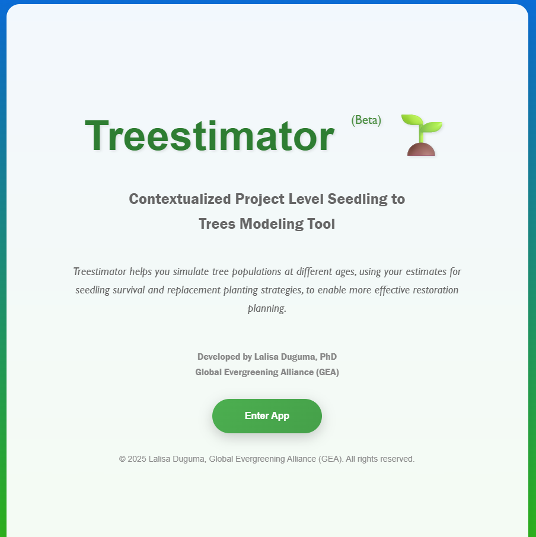
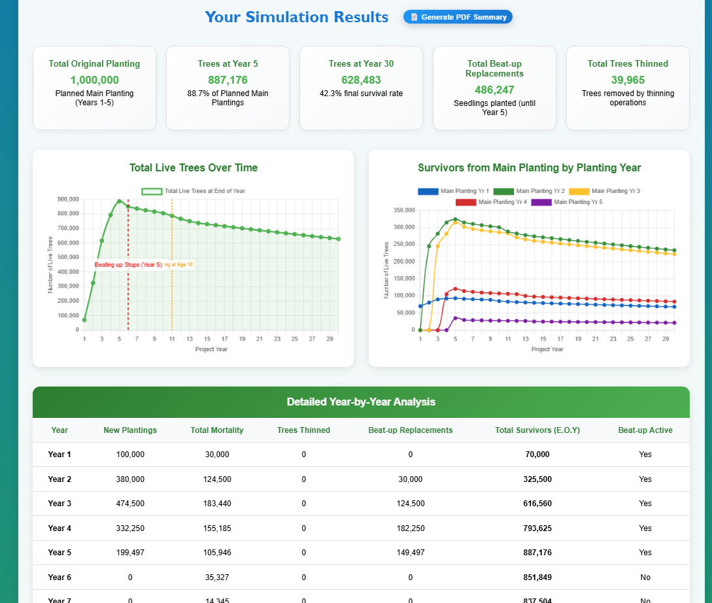
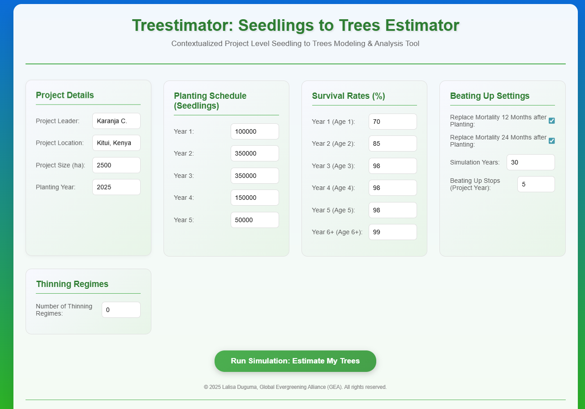
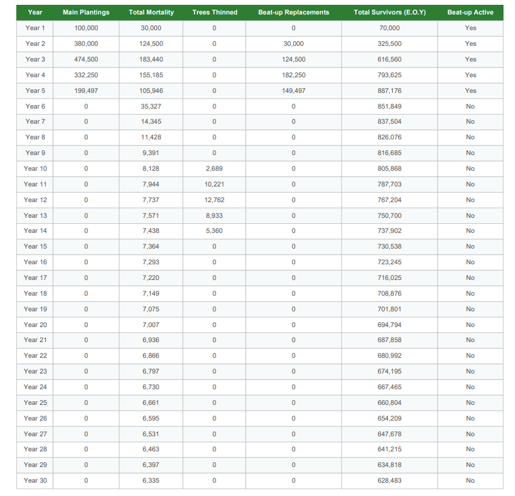

# Treestimator: Tree Population Simulator 🌱

Treestimator is a web-based simulation tool designed to help project leaders and environmental planners model tree populations over time. By simulating seedling survival, replacement planting (**beating up**), and thinning strategies, the tool provides a clear, year-by-year analysis of project outcomes. This enables more effective and data-driven restoration planning.

## 🚀 Key Features



*Main interface showing input parameters and simulation controls*

* **Interactive Simulation:** Enter your project details, planting schedule, and survival rates to generate a dynamic projection of your tree population.
* **Cohort-Based Modeling:** The tool tracks each year's plantings as separate cohorts, providing a detailed view of how different planting groups perform over their lifecycle.
* **Flexible Inputs:** Customize key parameters such as planting schedules, age-based survival rates, beating-up strategies, and thinning regimes.
* **Visual Data Analysis:** Understand your project's trajectory at a glance with interactive charts for total live trees and cohort survival.
* **Detailed Reporting:** Get a comprehensive year-by-year table of your simulation results and a summary of key metrics.
* **PDF Export:** Easily generate and download a professional PDF summary of your simulation for reporting and sharing.



*Example of generated PDF report with detailed analysis*

## 🛠️ How It Works

Treestimator uses a robust simulation model based on the following principles:

* **Cohort Tracking:** Each initial planting and subsequent beating up (replacement) event is treated as a distinct group of trees (a **cohort**).
* **Age-Based Survival:** The number of surviving trees in each cohort is calculated annually based on user-defined survival rates for different age categories.
* **Beating Up Logic:** You can specify whether to replace trees that die in the first two years and define a cutoff year for when these replacement activities cease.
* **Thinning Application:** You can define multiple thinning regimes by specifying the age and percentage of trees to be removed. Thinning is applied before natural mortality for that year.
* **Mathematical Model:** The core calculation for each cohort is:

```
Survivors(end of year) = Survivors(start of year) × Survival Rate(age) × (1 - Thinning Rate if applicable)
```

## 🖥️ Technologies Used

Treestimator is a single-page application built with modern web technologies:

* **HTML5:** For the page structure and user interface.
* **CSS3:** For styling, responsiveness, and an engaging visual design.
* **Vanilla JavaScript:** For all the simulation logic, user interactions, and dynamic content generation.
* **Chart.js:** A powerful JavaScript library used for creating the interactive and visually appealing charts.
* **jsPDF & jsPDF-AutoTable:** Libraries for generating the PDF report from the simulation results.

## 📝 Get Started

To use the Treestimator locally, simply download or clone this repository and open the `index.html` file in your web browser. There are no server-side dependencies.

```bash
# Clone the repository
git clone https://github.com/LDuguma/treestimator.git

# Navigate to the project directory
cd treestimator

# Open index.html in your browser
# (You can just double-click the file)
```

## 📸 Screenshots

### Input Interface


*User-friendly input forms for project parameters*

### Simulation Results


*Comprehensive results table showing year-by-year projections*


## 👩‍💻 Developed By

**Lalisa Duguma, PhD**  
Global Evergreening Alliance (GEA)

This project was developed to provide a practical tool for environmental and forestry professionals to better plan and manage their tree-based restoration initiatives.

## 📜 License

© 2025 Lalisa Duguma, Global Evergreening Alliance (GEA). All rights reserved.

This tool is provided for estimation purposes only. The developer is not liable for any damages resulting from its use. Always consult with a qualified professional for critical decisions.
